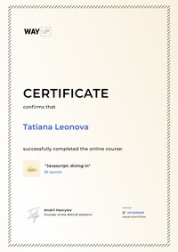
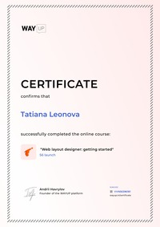
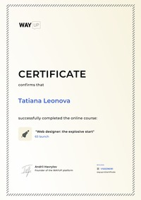

# Leonova Tatiana

## Contacts


tanya.leonova.24012003@gmail.com  
[Instagram](https://www.instagram.com/l_tatiana_24/ "@l_tatiana_24")  
[Telegram](https://t.me/tanyaLeonova03 "@tanyaLeonova03")  
GitHub: @TanyaLnv  
Discord rs-school: Tanya(@TanyaLnv)  
  
  


## About me

I'm looking to develop my programming skills. I like to be inspired by incredible work on creating the visual component of websites. However, I don’t want to limit myself to front-end, because creating a whole product is much more beautiful. 

### What am I like?

* calm
* eager
* friendly  
* sociable  
* responsible
* hard-working

I believe that we create our own life.

## Skills

While studying at the university, I worked (and continue to work) with
### Language
* C/C++
* Java
### Framworks
* Hibernate
### Version control system
* Git
### Databases
* SQLServer
* MySQL
### Development tools
* IntelliJ IDEA 
* Visual Studio
* Sublime Text
## Code example

Function accepts a string parameter, and reverses each word in the string. All spaces in the string are retained.  
("This is an example!" ==> "sihT si na !elpmaxe")
```java
public class Kata
{
     public static String reverseWords(final String original)
    {
        String [] strs = original.split(" ");
        String[] str = new String[strs.length];
        for(int i = 0; i<strs.length; i++)
        {
            strs[i] = new StringBuilder(strs[i]).reverse().toString();
        }

        String joined = String.join(" ", strs);
        return joined;
    }
}
```
## Education

#### 2020 - 2024 (in progress)   
Economist-programmer  
Faculty of Engineering and Economics   
Belarusian State University of Informatics and Radioelectronics

#### 2015-2020  
Yelsk gymnasium

#### Courses
WayUP:
* Javascript: diving in   
  
* Web layout designer: getting started  
 
* Web designer: the explosive start  
 

## Languages

* Russian (native)  
* English (intermediate)